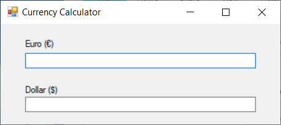
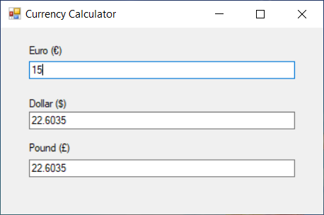

# Problema

Uma calculadora de moedas permite converter Euros (€) em Dólares ($) e vice-versa. O utilizador introduz o valor em Euros, e é realizada automaticamente a conversão para Dólares (e vice-versa). Apenas números decimais são permitidos.

Um novo requisito precisou ser implementado e inclui conversão de/para Libras (£).

